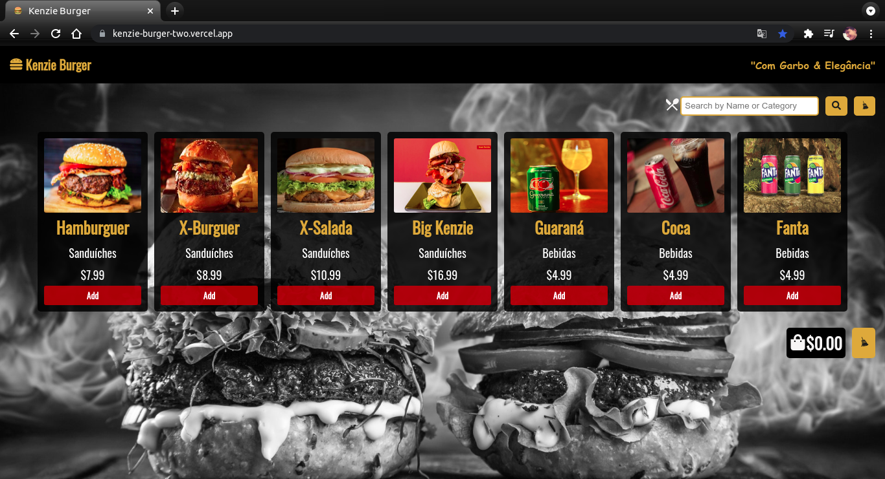
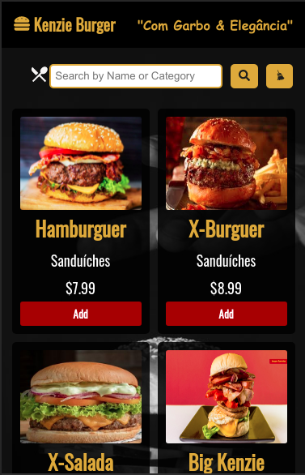

<h1>Kenzie Burger</h1>
<h2>Description</h2>

Proposed as the first delivery of the second module at Kenzie Academy Brazil, Kenzie Burger
consists of a menu interface containing items from a burger shop, which can be searched and/or added to and removed from a cart, and maintains a constant price update based on what items were added in the purchase made.

<h2>Technologies</h2>
<ul>
    <li>HTML5</li>
    <li>CSS3</li>
    <li>Javascript ES6+</li>
    <li>React</li>
</ul>
<h2>Screens</h2>
<h3>Desktop Version</h3>

<h3>Mobile Version</h3>

<h2>How To Use</h2>

Access: https://kenzie-burger-two.vercel.app/

